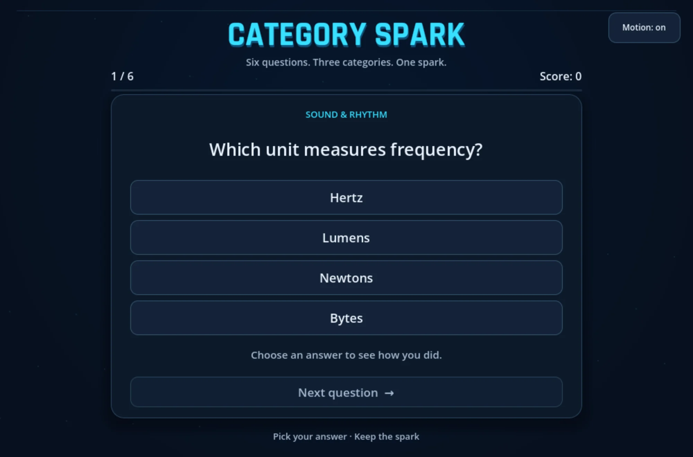

# Category Spark

Trivia game made with Godot 4: six questions in three categories, instant feedback, a score and a new round, in Russian and English. Every category plays in its own colour world with an animated backdrop.



- Play in the browser: https://velmren.com/assets/godot/web/ (add `?lang=ru` or `?lang=en` to choose the language)
- Windows build: https://velmren.com/assets/godot/CategorySpark-Windows-x64.zip
- Case page: https://velmren.com/en/godot/

## What it does

- Six fixed questions about sound, the web and space, loaded from `data/questions.json`. Answer positions vary between questions.
- Each category has its own colour and motif: a yellow speaker with travelling sound rings, blue browser windows with a cursor clicking a link, an indigo planet with orbiting moons. Moving to another category is a circle of the new colour growing from the button you pressed.
- Answers are push buttons that lift on hover and sink when pressed. A correct answer turns green, draws a check mark and throws a spark; a wrong one turns red, shakes and draws a cross, and the correct answer is revealed. The verdict slides up from the bottom with the Next button, so colour is never the only signal.
- An accepted answer cannot be changed or scored twice. Next question appears only after an answer; after question six it becomes See results. The result screen shows the score and a mark for every question by category; Play again starts a new round.
- Russian and English: interface, questions, answers, verdicts, the result and category names. The game starts in the language of the system or browser; the RU and EN switch in the top bar changes it at any moment without losing the round and remembers the choice.
- Soft marimba and kalimba cues for choosing, right and wrong answers, category changes and the result. The Sound and Motion switches turn off the sound and all animation.
- Mouse, keys 1 to 4, or Tab with Space and Enter. Focus rings appear while the keyboard is in use.
- The interface scales with the window and picks one of three layouts by its proportions: a 2×2 grid of answers, a compact grid for short landscape windows such as 844×390, and a list with a stacked verdict for portrait windows such as 390×844.
- If the question file is missing or invalid, the game shows a recovery message instead of starting a round.

There are no accounts, backend, online leaderboard or music.

## Tech stack

Godot 4.7.2, GDScript, Compatibility renderer. Everything on screen is drawn by the game's own Control nodes and `_draw` code; there are no image assets besides the app icon.

Type: Londrina Solid Black for the wordmark, numbers and English headlines, Gabarito for English answers and labels. Londrina and Gabarito have no Cyrillic, so Russian text uses Fira Sans Extra Condensed Black and Onest, chosen for the same weight and width. Short Russian words are kept with the next word so that a line never ends on a preposition.

## Language

The first match wins:

1. `?lang=ru` or `?lang=en` in the web build's address, or `-- --lang=ru` on the command line;
2. the choice made with the switch, saved in `user://settings.cfg`;
3. on the web, the language the hosting site remembers in `localStorage` (`velmren.lang`);
4. the system or browser language: Russian for `ru` and `be`, English otherwise.

Interface text lives in `scripts/strings.gd`; question text lives in the question file.

## Getting started

Prerequisites: [Godot 4.7.2](https://godotengine.org/download/). In the commands below, replace `godot` with the path to your Godot executable. On Windows, use the `_console.exe` build to see test output.

Run the game from the editor (open `project.godot` and press F5) or from the command line:

```sh
godot --path .
godot --path . -- --lang=ru
```

### Tests

Import the project once, then run the headless checks:

```sh
godot --headless --path . --import
godot --headless --path . --script res://tests/import_check.gd
godot --headless --path . --script res://tests/gameplay_check.gd
```

`import_check.gd` loads the real question set and three broken files from `tests/` (a duplicate ID, a missing field and a missing translation) and expects specific error codes. `gameplay_check.gd` plays a round through the scene: scoring, the answer lock, round completion, the result screen, restart, the wrong-answer message, and a switch to Russian and back in the middle of an answered question. Both exit with code 1 on failure.

`tests/capture_run.gd` plays a round with real viewport mouse and keyboard events at a given window size and language, checks that controls stay inside the window and that text does not overlap buttons, and saves PNG captures. It needs a rendering window, so it does not run headless; `--audio-driver Dummy` keeps it silent. Example in PowerShell:

```powershell
$env:CATEGORY_SPARK_CAPTURE_DIR = "$PWD/output/ru/390x844"
$env:CATEGORY_SPARK_WIDTH = "390"
$env:CATEGORY_SPARK_HEIGHT = "844"
$env:CATEGORY_SPARK_LANG = "ru"
godot --audio-driver Dummy --path . --script res://tests/capture_run.gd
```

Set `CATEGORY_SPARK_RECORD=1` and replace `--audio-driver Dummy` with `--write-movie output/round.avi --fixed-fps 60` to record the run as video with sound.

### Builds

Install the Godot 4.7.2 export templates, then use the included presets. The target folders must exist:

```sh
mkdir -p output/web
godot --headless --path . --export-release "Windows Desktop" output/CategorySpark.exe
godot --headless --path . --export-release "Web" output/web/index.html
```

The Windows build is a single x86_64 executable with the game data embedded; it is not code-signed. The web build is single-threaded, so any static host can serve it without special headers. Tests and docs are excluded from both packs.

## Question format

`scripts/trivia_importer.gd` treats the JSON as data and validates it before the game uses it. The current format is `velmren-trivia-v2`: one file lists its languages and holds every translation.

```json
{
  "format": "velmren-trivia-v2",
  "languages": ["en", "ru"],
  "categories": [
    {
      "id": "web",
      "label": { "en": "Web Basics", "ru": "Основы веба" },
      "questions": [
        {
          "id": "web-01",
          "prompt": { "en": "Which protocol normally secures a website connection?", "ru": "Какой протокол обычно защищает соединение с сайтом?" },
          "options": ["PNG", "CSV", "HTTPS", "MIDI"],
          "correct_index": 2
        }
      ]
    }
  ]
}
```

A text is either an object with a non-empty string for every listed language, or a single string used in all of them, which suits names such as HTTPS. Question IDs must be unique and `correct_index` must be an integer inside the options list; the right answer and the order of options are shared by all languages. Files in the older `velmren-trivia-v1` format, with plain strings only, still load as an English set. A failed check returns a structured error such as `DUPLICATE_QUESTION_ID:<id>`, `MISSING_QUESTION_FIELD:<field>` or `MISSING_TRANSLATION:<id>:<language>`.

Categories take the colour worlds in file order (yellow, blue, indigo); a fourth category starts again from yellow.

## Project structure

```
scripts/
  main.gd             round flow, scoring, input, language, the three layouts, transitions
  strings.gd          interface text in Russian and English
  style.gd            colour worlds, fonts for each language, stroke helpers
  backdrop.gd         animated category backdrops and the colour wipe
  tile_button.gd      push button with the answer states
  hud.gd              wordmark, progress pips, score, sound, motion and language switches
  breakdown.gd        per-category result list
  confetti.gd         confetti for a good round
  sfx.gd              sound playback
  trivia_importer.gd  JSON validation
data/                 questions.json
assets/fonts/         Londrina Solid Black, Gabarito, Fira Sans Extra Condensed Black, Onest and their licences
assets/sfx/           sound cues (WAV)
tests/                headless checks, the capture runner and broken JSON fixtures
docs/                 README screenshot; .gdignore keeps it out of the Godot import
main.tscn             main scene
export_presets.cfg    Windows Desktop and Web export presets
icon.svg              app icon
```

## Credits

- Londrina Solid by Marcelo Magalhães, Gabarito by Naipe Foundry, Fira Sans Extra Condensed by the Mozilla Foundation and Telefonica, Onest by the Onest Project Authors; all under the SIL Open Font License 1.1, see `assets/fonts/`.
- Sound effects: Velmren.
- Built with [Godot Engine](https://godotengine.org/). Engine licence and third-party notices: https://godotengine.org/license/

## License

MIT, see [LICENSE](LICENSE).
